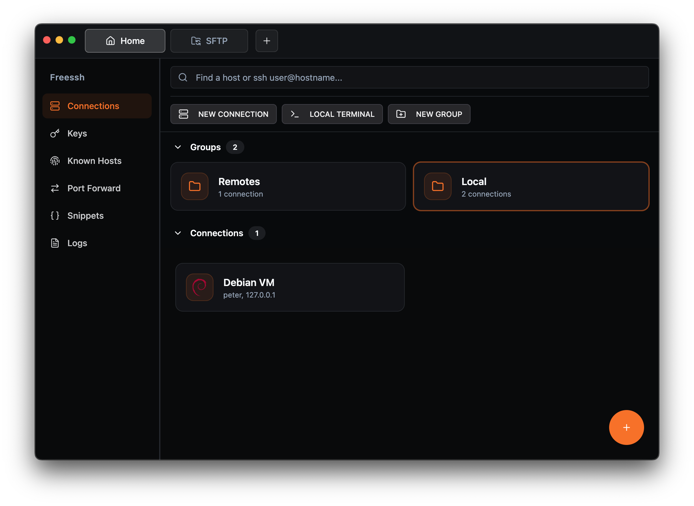

# FreeSSH

**A free, open-source, local-first SSH client.**

FreeSSH is a local-first, free and open-source alternative to Termius, built for developers and operators who want a fast desktop SSH workflow without vendor lock-in.

## Why FreeSSH

- Always free and open source
- Extremely optimized and fast
- Local-first by design
- Desktop-focused SSH and SFTP workflows
- Built for everyday terminal operations

## Features

- Multi-session terminal tabs (local and remote)
- Integrated SFTP browser for local/remote file operations
- SSH key generation, import, export, and management
- Known hosts management and host-key verification flow
- SSH port forwarding support
- Command snippets for repeatable workflows
- Session logging and log viewer
- Command history support in terminal workflows
- Connection grouping and search

## Platform Status

FreeSSH is currently in **Beta**.

- macOS: primary tested platform
- Linux: beta testing in progress
- Windows: beta testing in progress

Feedback from beta users is helping harden Linux and Windows support before stable release.

## Download

Prebuilt installers are published on the GitHub Releases page:

- https://github.com/Adelodunpeter25/freessh/releases

- macOS: `.dmg` (x64, arm64)
- Windows: `.msi` (x64)
- Linux: `.deb` and `.AppImage` (x64)

If you do not see a build for your platform yet, run locally from source (below).

## Run Locally

### Prerequisites

- Bun (recommended for this repo)
- Go (for the backend in `backend/`)

### Dev (hot reload)

1. Install dependencies:
   - `bun install`
2. Build the backend binary (required for the desktop app to function in dev):
   - `bun run build:backend`
3. Start Electron + Vite:
   - `bun run dev`

### Build (production preview)

1. Build backend + frontend bundles:
   - `bun run build:backend`
   - `bun run build`
2. Preview the built app:
   - `bun run start`
